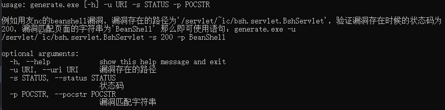
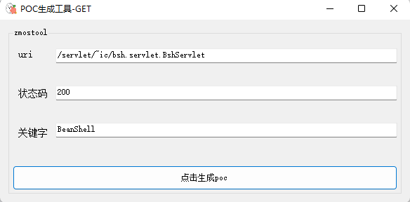
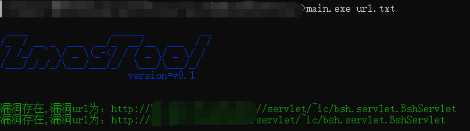

# ZMOSTOOL

# 简介

```Plain
generate旨在为安全测试人员降低编写poc的门槛，高效将反复造poc轮子的时间去用来批量验证挖掘漏洞。安全测试人员可以通过向工具传输生成poc所需要用到的参数包括，uri路径，验证状态码，漏洞匹配关键字来直接生成批量验证的poc工具。工具分为命令行版与UI界面版。目前仅支持GET请求的POC工具生成。
```

# NEED

```Plain
工具的使用需要python安装模块包括：
os
time
argparse

且还需要有Go语言的环境
```

# USE

## 命令行版

使用命令`generate.exe -h` 即可查看其所支持的使用参数情况，以及工具使用案例



例：

```Plain
generate.exe -u /servlet/~ic/bsh.servlet.BshServlet -s 200 -p BeanShell
```

## UI界面版

直接点击文件`generate-ui.exe` ，根据提示填写参数即可生成poc工具



执行之后会在当前的文件夹生成一个`main.exe`的文件，其使用方式是`main.exe xxx.txt` 直接将批量的url写入txt文本中即可对其进行批量验证。



# 免责声明

```Plain
    本工具仅面向合法授权的企业安全建设行为，在使用本工具进行检测时，您应确保该行为符合当地的法律法规，并且已经取得了足够的授权。  

    如您在使用本工具的过程中存在任何非法行为，您需自行承担相应后果，本人将不承担任何法律及连带责任。 

    在使用本工具前，请您务必审慎阅读、充分理解各条款内容，限制、免责条款或者其他涉及您重大权益的条款可能会以加粗、加下划线等形式提示您重点注意。 除非您已充分阅读、完全理解并接受本协议所有条款，否则，请您不要使用本工具。

    您的使用行为或者您以其他任何明示或者默示方式表示接受本协议的，即视为您已阅读并同意本协议的约束。
```
